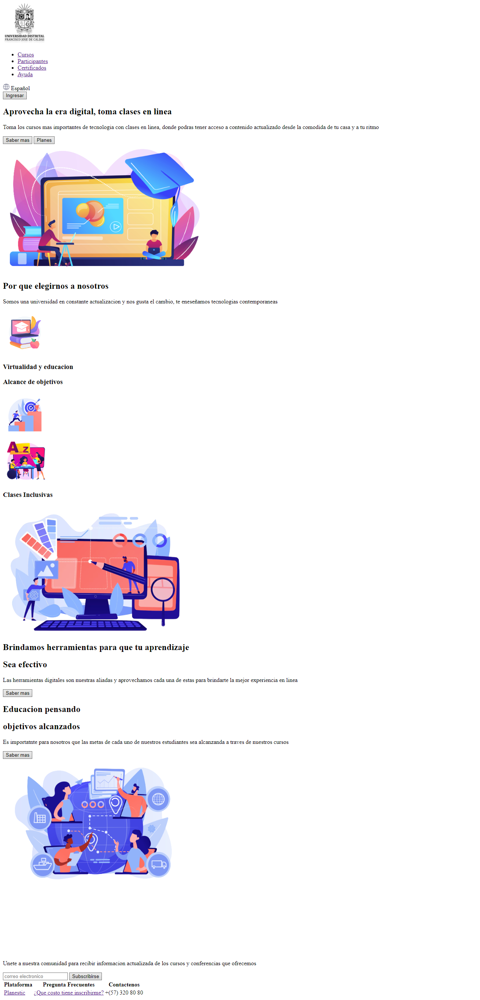

<h1>Taller 9 Mateo Bejarano Rodriguez</h1>

<h2> Información</h2>

Curso: full Stack Basico - Grupo 1

Profesor: Cristian Patiño

<h2> Punto 1: Link figma</h2>

<a href="https://www.figma.com/file/bnOqPgebOsENAvzZudkewo/Mateo-Bejarano-Rodriguez-figma?type=design&node-id=19%3A298&mode=design&t=hSkUaICLLFsPPqI0-1" target="_blank">Link de Figma</a>

<h2>punto 2: HTML</h2>
